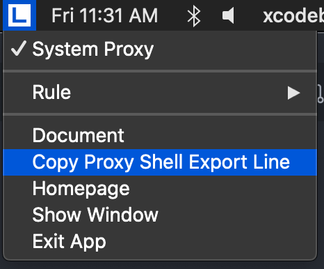

LightProxy 的代理设置默认只对浏览器和 Webview 等生效，如果需要在命令行中（例如 curl 等）生效，可以使用 menubar 上提供的复制 shell 脚本功能。



点击后会自动把代理命令复制到剪贴板，**在 shell 中粘贴执行后**，`curl` 等命令就会通过 `LightProxy` 的代理。

例如我们执行

```shell
export https_proxy=http://127.0.0.1:12888 http_proxy=http://127.0.0.1:12888 all_proxy=socks5://127.0.0.1:12889
curl https://baidu.com -I
```

得到的结果是

```
HTTP/1.1 200 Connection Established
Proxy-Agent: whistle

HTTP/2 302
server: bfe/1.0.8.18
date: Fri, 19 Jun 2020 03:36:36 GMT
content-type: text/html
content-length: 161
location: http://www.baidu.com/
__lightproxy-host-ip__: 127.0.0.1
__lightproxy-rules__: none
__lightproxy-real-url__: https://baidu.com/
__lightproxy-help__: See https://github.com/alibaba/lightproxy
```

需要注意的是，这种方式只有读取环境变量的应用才会通过代理，并不会对所有的应用生效。

