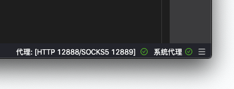
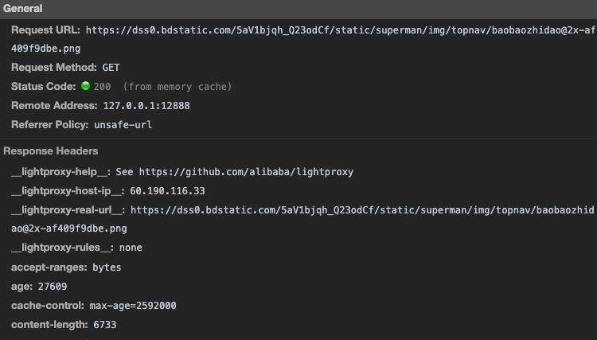

## 代理不生效怎么办

### 检查代理状态

首先确定 LightProxy 的右下角代理和系统代理状态都是 OK 的，如图：



### 确认浏览器中代理是否生效

随便打开一个网页，打开 Chrome Devtools 的 Network 界面，确认 response header 中如果有 lightproxy 的字样，说明代理生效了。



<Alert>默认情况下 127.0.0.1 和 localhost 都是不过代理的，如果你需要使用可以把其他域名代理到 127.0.0.1 然后用其他域名进行开发</Alert>

### 证书错误

如果提示证书错误，可以在 LightProxy 的菜单中使用 Help => Install Certificate & Helper。

<Alert>对于 Windows 用户，你可能需要右键 => 属性 => 以管理员身份运行。然后再尝试上述动作。</Alert>

### Windows 用户

- Windows 用户的 Chrome 如果代理不生效，尝试重启下 Chrome
- Windows 用户如果出现证书错误，你可能需要右键 => 属性 => 以管理员身份运行，然后在 LightProxy 的菜单中使用 Help => Install Certificate & Helper。

## 如何和其他代理应用一起使用

部分同样使用系统代理的应用可能会抢占 LightProxy 的代理，你可以把 LightProxy 设置为系统代理后，通过 

```html
/xxx/ socks5://127.0.0.1:1080
```

这样的方式指定满足匹配条件的页面通过 `socks5://127.0.0.1:1080` 的代理进行转发。

或者通过

```html
/.*/ socks5://127.0.0.1:1080
```

的方式设置一个前置代理。


对于 HTTP 代理，使用 

```html
/.*/ proxy://127.0.0.1:1080
```

具体可以参考 [https://github.com/alibaba/lightproxy/issues/91](https://github.com/alibaba/lightproxy/issues/91)


## Cannot be opened because the developer cannot be verified

是因为没有苹果开发者证书签名导致的，参考 https://support.apple.com/en-us/HT202491

打开设置 => 安全


点击 Open anyway，然后确定
