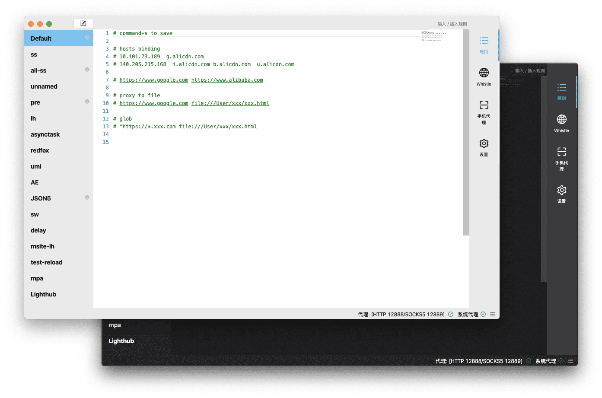
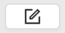
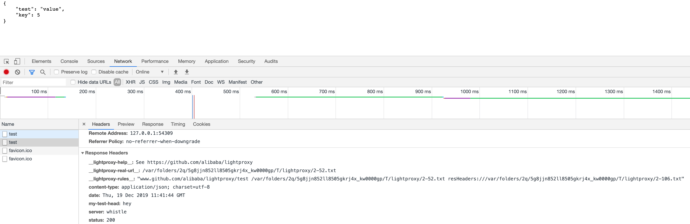

---
nav:
  title: 快速开始
  order: 1
order: 1
---

# 快速开始

## 下载

[**macOS 版**](https://gw.alipayobjects.com/os/LightProxy/LightProxy.dmg)

[**Windows 版**](https://gw.alipayobjects.com/os/LightProxy/LightProxy-Setup.exe)

** Linux 版即将到来 **

## 介绍

LightProxy 是一款基于 `whistle` 的本地代理抓包软件

## LightProxy 能帮你做什么

- 抓包，包括无线场景抓包
- 实时 `hosts` 绑定
- 按规则转发资源
- `mock` 接口，页面等
- 修改请求和响应内容，例如在页面中插入 `script` ，修改返回头等

## 安装

打开 `DMG` 后，把 `LightProxy` 拖动到 `Application` 中

## 启动

在应用列表中启动 `LightProxy` ，第一次启动时 `LightProxy` 会询问两次密码，这是用于安装辅助程序和自动安装证书。

## 使用 / 来快速插入规则

点击左上角的  新建规则，直接输入 `/` 可以快速插入规则

例如我们选择 `Mock JSON`

我们会通过 `snippet` 补全一个 `JSON` 规则，可以通过 `Tab` 快速跳转。这里的 `` 类似 ES6 字符串的用法是在 `whistle` 基础上拓展的语法，可以支持多行内容直接写到规则里。

然后我们打开浏览器访问 `https://www.github.com/alibaba/lightproxy`

可以看到返回的内容是我们写的 `JSON` ，返回的 `header` 中也有我们写的 `my-test-head` ，同时 `__lightproxy-real-url__`等 `header` 也可以帮助我们快速定位实际生效的文件。

## 更多规则

除了多行字符串语法外， `LightProxy` 语法就是 `whistle` 语法，可以直接参考 `whistle` 的规则文档：[https://wproxy.org/whistle/principle.html](https://wproxy.org/whistle/principle.html)

## 反馈

反馈 `issue` 到 [https://github.com/alibaba/lightproxy/issues](https://github.com/alibaba/lightproxy/issues)

微信讨论群见：[https://github.com/alibaba/lightproxy/issues/93](https://github.com/alibaba/lightproxy/issues/93)

