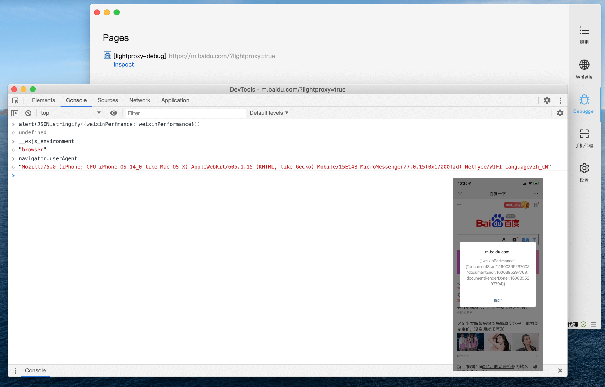

# Remote debugging

In the wireless development scenario, we often need to debug the browser and App of the wireless device. In some cases, we can use the Remote Debugger function of Chrome or Safari to debug with the USB cable.
However, in some scenarios, we do not have such conditions. LightProxy will use the proxy capabilities to quickly inject remote debugging capabilities.

The picture shows Debug in WeChat Webview of iOS.

## How to use

Open the Debugger Tab, and then visit the page with the parameter `lightproxy=true` through the proxy, and you will see the inspect button on the Tab.

If you want to debug the wireless page, please make sure that the phone has set the proxy correctly.
