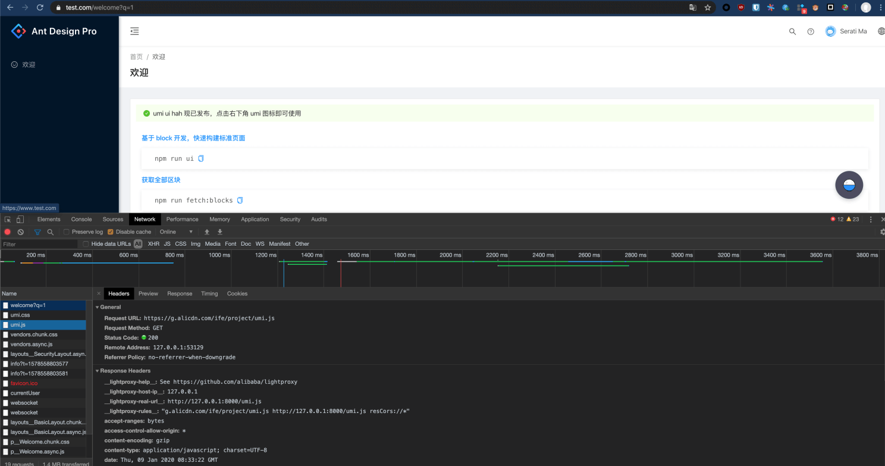

部分 umi 和 antd pro 的用户在的静态资源需要单独发布，然后通过 js 引用到后端的页面上。


如果我们需要在本地开发时把 js 直接联调到线上的页面，需要把线上的地址代理到本地，但是会碰到一些问题（例如 HMR ， common.js 等），所以写个文档专门介绍下怎么使用。

## 转发文件

举个例子，我们有一个后端页面， js/css 被我们发到 g.alicdn.com


假设我们的这个页面域名为 www.test.com ，在页面上引用了

```html
https://g.alicdn.com/ife/project/umi.css
https://g.alicdn.com/ife/project/umi.js
```

两个托管在 CDN 上的 css 和 js 。


但是单纯的转发这两个文件是不够的的，因为在本地开发时， umi 还会提供 HMR ，异步加载， vendor 等功能，我们需要把这些东西也转发过去。


所以对应的规则为：

```html
# 代理两个主要文件，根据具体的 URL 修改
g.alicdn.com/ife/project/umi.css http://127.0.0.1:8000/umi.css
g.alicdn.com/ife/project/umi.js http://127.0.0.1:8000/umi.js

# 本地开发的异步加载的 async js/css 和 vendor 等都会从 / 加载，所以要做相应的转发
^www.test.com/***.js http://127.0.0.1:8000/$1.js
^www.test.com/***.map http://127.0.0.1:8000/$1.map
^www.test.com/***.css http://127.0.0.1:8000/$1.css

# /socksjs-node/ 是 HMR 功能使用的，要把下面的 ws/xhr 做转发
^www.test.com/sockjs-node/*** http://127.0.0.1:8000/sockjs-node/$1

# :3000/ 的转发是 umi-ui 使用的接口，同样转发过去
www.test.com:3000 http://127.0.0.1:3000/

# 一般来说这一条是不需要的，因为线上的 API 往往是直接走线上的 API 就可以，但是如果需要的话可以加上
# 把 API 转发到本地
# ^www.test.com/api/*** http://127.0.0.1:8000/api/$1
```

<Alert>
注意: 上面的端口号和域名可能需要根据实际情况做一些改变。
</Alert>

## 预览

修改一下 Welcome.jsx 页面能够进行 Hot reload



