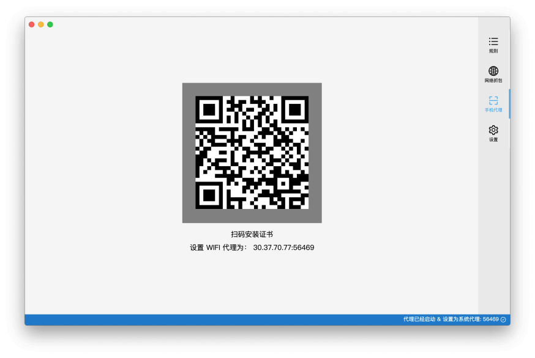
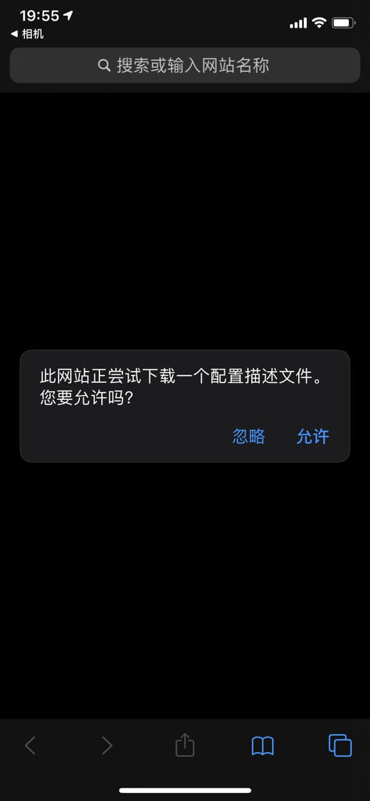
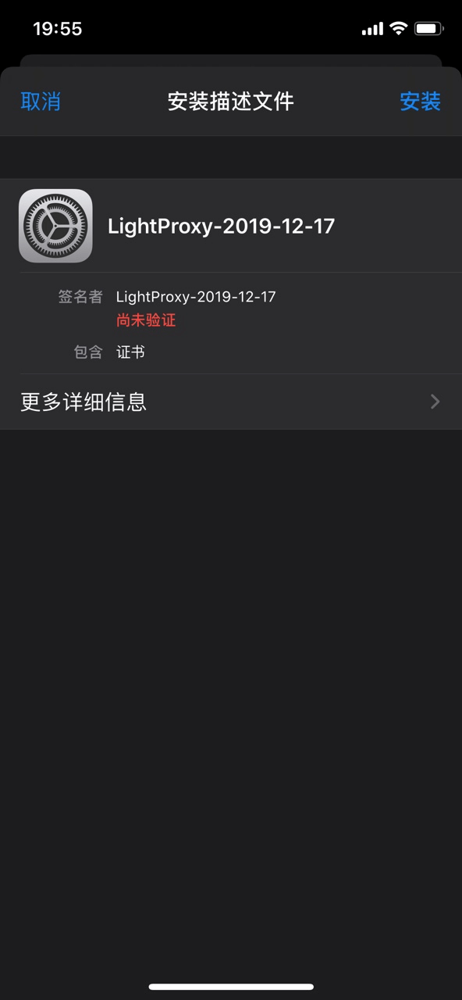
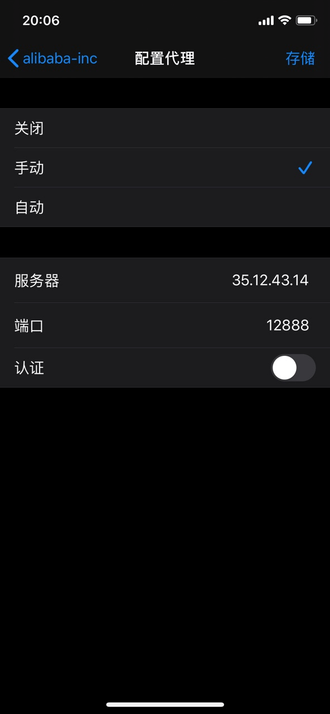

LightProxy can also support wireless agent proxy packet capture and forwarding, click the tab of the mobile phone proxy on the right (it will automatically make the proxy visible on the LAN).

You can see a QR code (different machines have different QR codes, you need to scan your own QR code), scan the QR code to download the corresponding certificate, and install it.

## Install Certificate

Installing the certificate has different operations for different mobile phones

### iOS users

Turn on the camera, scan the QR code, open it in Safari, and install the description file

After downloading, go to Settings and find the downloaded description file

Then install the description file

There is one final step after installation, go to `Settings => General => About This Machine => (pull to the bottom) certificate trust setting, check LightProxy certificate

Set the proxy in Wifi to the address and port number displayed in the interface

## Android users

There are many models of Android, and the method of installing the trust certificate is slightly different on different machines. The general method is to scan the code to download, and then choose to install the certificate from the system-security-credit credentials.

<Alert>
In addition, in the high version of Android, it is necessary to apply the active declaration to support the user certificate. You can first try whether the Android Chrome proxy is successful.
</Alert>
