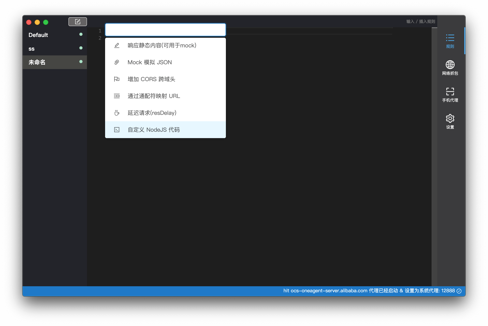
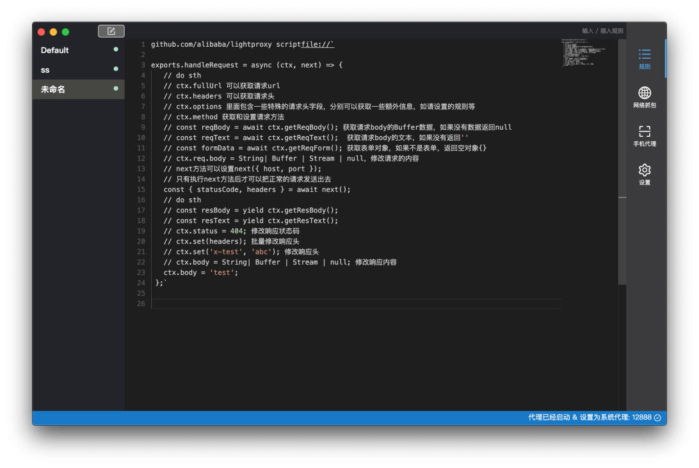

从 LightProxy 1.0.9 版本开始，我们支持直接使用 NodeJS 书写规则，以解决一些灵活复杂的需求。

## 使用

同样可以输入 / 来获取自动模板






## 书写

支持行内的写法

```
github.com/alibaba/lightproxy scriptfile://`

exports.handleRequest = async (ctx, next) => {
  // do sth
  // ctx.fullUrl 可以获取请求url
  // ctx.headers 可以获取请求头
  // ctx.options 里面包含一些特殊的请求头字段，分别可以获取一些额外信息，如请设置的规则等
  // ctx.method 获取和设置请求方法
  // const reqBody = await ctx.getReqBody(); 获取请求body的Buffer数据，如果没有数据返回null
  // const reqText = await ctx.getReqText();  获取请求body的文本，如果没有返回''
  // const formData = await ctx.getReqForm(); 获取表单对象，如果不是表单，返回空对象{}
  // ctx.req.body = String| Buffer | Stream | null，修改请求的内容
  // next方法可以设置next({ host, port });
  // 只有执行next方法后才可以把正常的请求发送出去
  const { statusCode, headers } = await next(); 
  // do sth
  // const resBody = yield ctx.getResBody();
  // const resText = yield ctx.getResText();
  // ctx.status = 404; 修改响应状态码
  // ctx.set(headers); 批量修改响应头
  // ctx.set('x-test', 'abc'); 修改响应头
  // ctx.body = String| Buffer | Stream | null; 修改响应内容
  ctx.body = 'test';
};`
```

也可以直接指向一个文件


```
github.com/alibaba/lightproxy scriptfile:/path/to/file.js 
```